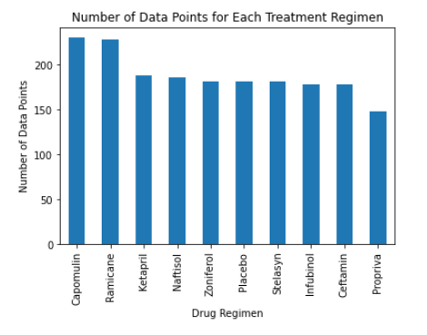
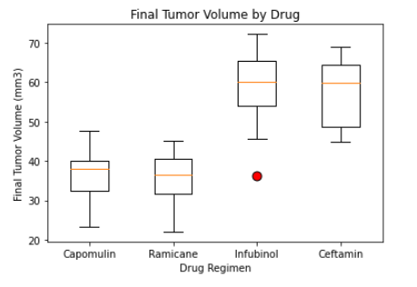

# Matplotlib

I studied tumor development in 249 mice identified with SCC tumor growth that were treated through a variety of drug regimens where tumor development was measured. The purpose of this study was to compare the performance of Pymaceuticals' drug of interest, Capomulin, versus the other treatment regimens. 

The first step was to clean the data and remove any duplicate mice.

* I generated the following visualizations using Matplotlib's pyplot:

* Total number of measurements taken for each treatment regimen throughout the course of the study.

 * Distribution of female or male mice in the study.

* Final tumor volume of each mouse across four of the most promising treatment regimens: Capomulin, Ramicane, Infubinol, and Ceftamin. I calculated the quartiles and IQR and quantitatively determine if there are any potential outliers across all four treatment regimens.

* Using Matplotlib, generate a box and whisker plot of the final tumor volume for all four treatment regimens and highlight any potential outliers in the plot by changing their color and style.

* Line plot of tumor volume vs. time point for that mouse for mouse s185.

 

* Correlation coefficient and linear regression model between mouse weight and average tumor volume for the Capomulin treatment. 

![Regression](Images/regression.png

